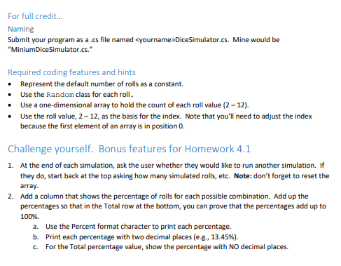

# Two Dice Roll Simulation

Two dice roll simulation with C# on the console, simulating the total outcome of rolling the two dices and their probabilities in %.

## Screenshot

## The given problem

 

 

